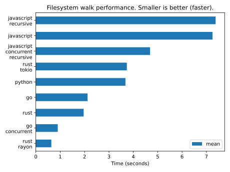

# `polyglot-walks`

Experiments with walking the filesystem in many languages.

Challenge: given a directory, recurse through the filesystem (ignoring
symlinks) and count the number of directories and files discovered.

## Results

Benchmarking is hard, I just slapped this together, and I don't really know
what I'm doing. Still, I believe some of these differences are material.

Here's what I got on my laptop when run against a large directory. The absolute
numbers don't matter, just the relative ones.

[Raw data](./benchmark/benchmarks.csv)

Feel free to [run the benchmarks yourself](./benchmark/README.md).
